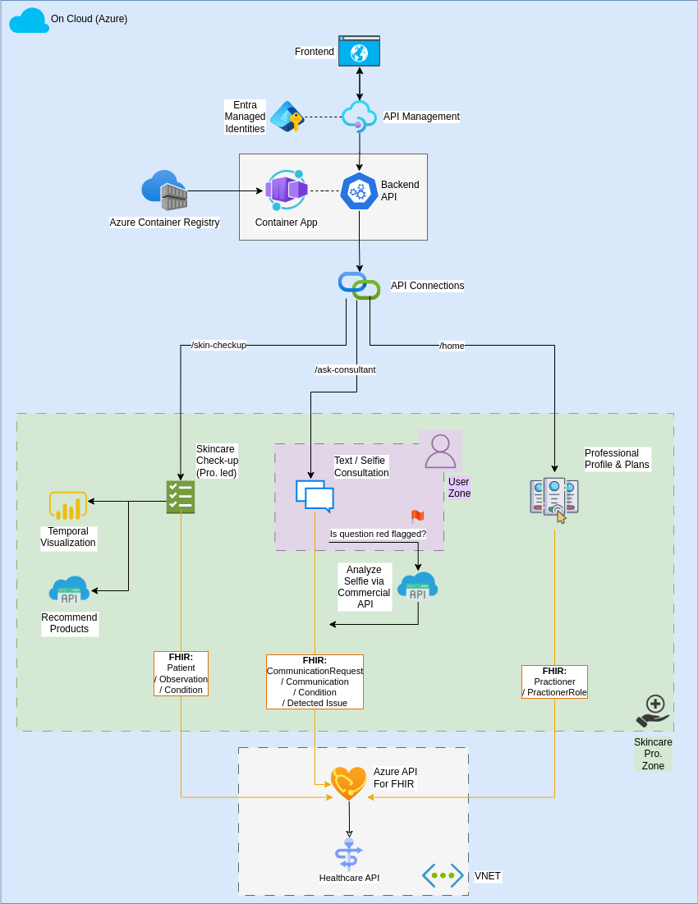

# SkInsight 🧠

SkInsight is a smart, Azure-hosted web application that enables dermatology clinics and skin researchers to securely store, view, and interact with patient images and metadata. Built on top of Microsoft Azure's FHIR API and Django, SkInsight ensures full compliance with healthcare data standards while remaining scalable and modular.

<br/>

## 🔧 Tech Stack

- **Backend**: Django  
- **Frontend**: Django Templates, TailwindCSS
- **Healthcare API**: Azure Health Data Services (FHIR API)  
- **Cloud Deployment**: Azure Container Apps
- **Security & Auth**: Google Outh2 for user authentication - Azure Active Directory OAuth2, VNET + Private Endpoint for authorization, 
- **CI/CD**: GitHub Container Registry (ghcr.io)
- **Compliance**: HIPAA-aligned design leveraging Azure's healthcare infrastructure  

<br/>

## 🧩 Key Features

- 🔐 **Secure & Compliant**: Uses Azure FHIR API with VNET and private endpoint to ensure protected access.
- 🖼️ **Image-Linked FHIR Resources**: Upload and retrieve all data as FHIR resources (e.g., Practitioner, Patient, PlanDefinition, Questionnaire).
- 🌐 **Role-based Access**: Google OAuth2 login integrated with Django user model and RBAC managed via Django groups.
- 👤 **FHIR-based User Storage**: Store skincare professionals and clients as FHIR `Practitioner` and `Patient` resources with linked demographics and roles.
- 🧾 **Follow-Up Quizzes & Progress Tracking**: Professionals conduct follow-up sessions using clinical-grade FHIR `Questionnaire` resources. Client responses are stored in `QuestionnaireResponse`, enabling longitudinal tracking and dynamic JS chart visualization of skin improvement.
- 📝 **Custom Professional Plans**: Each professional can define personalized care plans (e.g., N check-ins/month, frequency of follow-up) as `PlanDefinition` resources for clients to subscribe to.
- 🏷️ **Platform Subscriptions via FHIR**: Platform-wide tiers (Basic, Standard, Premium) are modeled as `PlanDefinition` resources, assigned to professionals through `PractitionerRole`.
- 🔁 **Versioned Plans & Subscription Integrity**: Supports version control across both platform-to-professional and professional-to-client plans, ensuring users retain original plan benefits until renewal, even if definitions change.
- 🧴 **Product Recommendation Engine**: Aggregates skin progress over sessions to recommend skincare products through monetized and clinically approved APIs.
- 📂 **Structured Metadata**: Store and view structured data for users and clinical interactions in FHIR-compliant format.
- 🧪 **MVP-Ready**: Clean UI, easily extendable, and ready for user feedback.


<br/>

## 🏗️ Architecture



<br/>

## 🚀 Getting Started

> The steps below assume you are using Azure CLI and have appropriate access permissions.
> ❗ ** Accessing FHIR through VNet**: To be able to access the FHIR server from your local machine, you have first to add the IP of your local machine to the VNet (Virtual Private Network).


```bash
git clone https://github.com/OmarLaham/SkInsight.git
cd SkInsight

# Build the Docker image
docker build -t skinsight .

# Run the container and expose it on port 8000
docker run -p 8000:8000 raiso
```

Then open your browser and navigate to:
👉 http://localhost:8000

---

## 🤝 Contribute To The Project

Contributions are welcome from all Azure Healthcare passionates!. Just fork, clone, explore — and feel free to open an issue or pull request.